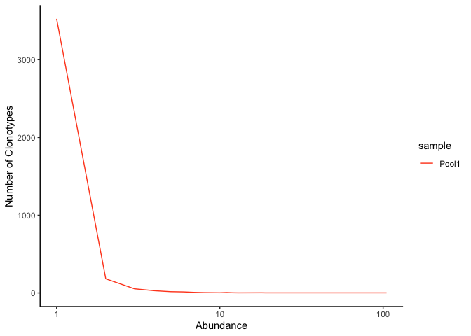
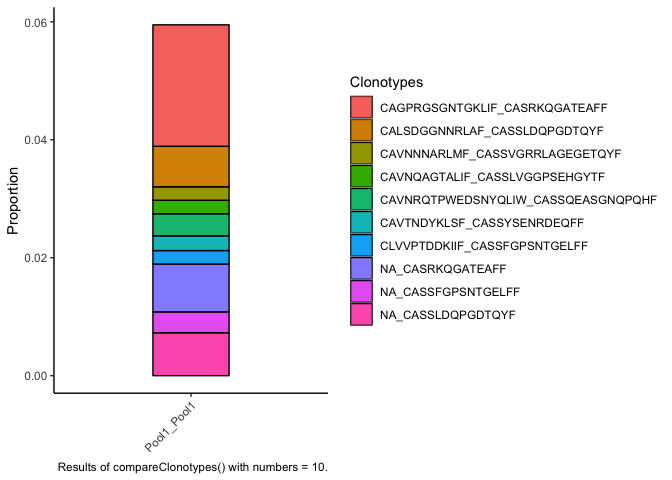

Last Updated March 23, 2022

# Single Cell V(D)J Analysis

## Packages

```r
if (!requireNamespace("BiocManager", quietly = TRUE)){
    install.packages("BiocManager")
}

if (!any(rownames(installed.packages()) == "ggplot2")){
  BiocManager::install("ggplot2")
}

if (!any(rownames(installed.packages()) == "knitr")){
  BiocManager::install("knitr")
}

if (!any(rownames(installed.packages()) == "kableExtra")){
  BiocManager::install("kableExtra")
}

if (!any(rownames(installed.packages()) == "dplyr")){
  BiocManager::install("dplyr")
}

if (!any(rownames(installed.packages()) == "tidyr")){
  BiocManager::install("tidyr")
}
if (!any(rownames(installed.packages()) == "magrittr")){
  BiocManager::install("magrittr")
}

if (!any(rownames(installed.packages()) == "scRepertoire")){
  BiocManager::install("scRepertoire")
}

library(ggplot2)
library(tidyr)
library(magrittr)
library(knitr)
library(kableExtra)
library(dplyr)
library(scRepertoire)
```

## Download Cell Ranger results

```r
options(timeout=1200)
download.file("https://raw.githubusercontent.com/ucdavis-bioinformatics-training/2022-March-Advanced-Topics-in-Single-Cell-RNA-Seq-VDJ/main/data_analysis/cellranger_vdj_results.zip", "cellranger_vdj_results.zip")
system("unzip cellranger_vdj_results.zip")
```

## Set-up

```r
experiment_name = "VDJ Example"
dataset_loc <- "./cellranger_vdj_results"
ids <- c("Pool1")
```

## Sequencing metrics

```r
metrics <- paste(dataset_loc, ids, "metrics_summary.csv", sep = "/")
metrics_table <- do.call("cbind", lapply(metrics, function(x) {
  as.data.frame(t(read.csv(x)))
  }))
colnames(metrics_table) <- ids
rownames(metrics_table) <- gsub(".", " ", rownames(metrics_table), fixed = TRUE)

metrics_table[c(4:9, 1, 2, 14, 13, 10, 3, 17, 19, 11, 15, 20, 22, 24, 26, 12, 16, 21, 23, 25, 27),]  %>%
  kable(caption = 'Cell Ranger Results') %>%
  pack_rows("Sequencing Characteristics", 1, 6, label_row_css = "background-color: #666; color: #fff;") %>%
  pack_rows("Cell Characteristics", 7, 14, label_row_css = "background-color: #666; color: #fff;") %>%
  pack_rows("TRA", 15, 20, label_row_css = "background-color: #666; color: #fff;") %>%
  pack_rows("TRB", 21, 26, label_row_css = "background-color: #666; color: #fff;") %>%
  kable_styling("striped", fixed_thead = TRUE)
```

## Read in Cell Ranger VDJ Data

```r
clonotypes <- paste(dataset_loc, ids, "filtered_contig_annotations.csv", sep = "/")
vdj <- combineTCR(lapply(clonotypes, read.csv),
                  samples = ids,
                  ID = ids,
                  cells = "T-AB",
                  removeMulti = TRUE)
class(vdj)
```

```
## [1] "list"
```

```r
str(vdj)
```

```
## List of 1
##  $ Pool1_Pool1:'data.frame':	4913 obs. of  14 variables:
##   ..$ barcode : chr [1:4913] "Pool1_Pool1_AAACCTGAGCAAATCA-1" "Pool1_Pool1_AAACCTGAGCTACCTA-1" "Pool1_Pool1_AAACCTGAGTACGCGA-1" "Pool1_Pool1_AAACCTGCAGTCCTTC-1" ...
##   ..$ sample  : chr [1:4913] "Pool1" "Pool1" "Pool1" "Pool1" ...
##   ..$ ID      : chr [1:4913] "Pool1" "Pool1" "Pool1" "Pool1" ...
##   ..$ TCR1    : chr [1:4913] "TRAV12-1.TRAJ10.TRAC" "TRAV17.TRAJ9.TRAC" "TRAV6.TRAJ45.TRAC" NA ...
##   ..$ cdr3_aa1: chr [1:4913] "CVVNTGGGNKLTF" "CATDARAGGFKTIF" "CALDMAYSGGGADGLTF" NA ...
##   ..$ cdr3_nt1: chr [1:4913] "TGTGTGGTGAACACGGGAGGAGGAAACAAACTCACCTTT" "TGTGCTACGGACGCGCGGGCTGGAGGCTTCAAAACTATCTTT" "TGTGCTCTAGACATGGCGTATTCAGGAGGAGGTGCTGACGGACTCACCTTT" NA ...
##   ..$ TCR2    : chr [1:4913] "TRBV2.TRBJ2-2.None.TRBC2" "TRBV20-1.TRBJ1-4.None.TRBC1" NA "TRBV2.TRBJ2-1.None.TRBC2" ...
##   ..$ cdr3_aa2: chr [1:4913] "CASSAGTGELFF" "CSARDLGQREKLFF" NA "CASRDARDLVPQFF" ...
##   ..$ cdr3_nt2: chr [1:4913] "TGTGCCAGCAGCGCCGGGACCGGGGAGCTGTTTTTT" "TGCAGTGCTAGAGATCTGGGACAGCGTGAAAAACTGTTTTTT" NA "TGTGCCAGCAGGGATGCCCGGGACCTCGTCCCGCAGTTCTTC" ...
##   ..$ CTgene  : chr [1:4913] "TRAV12-1.TRAJ10.TRAC_TRBV2.TRBJ2-2.None.TRBC2" "TRAV17.TRAJ9.TRAC_TRBV20-1.TRBJ1-4.None.TRBC1" "TRAV6.TRAJ45.TRAC_NA" "NA_TRBV2.TRBJ2-1.None.TRBC2" ...
##   ..$ CTnt    : chr [1:4913] "TGTGTGGTGAACACGGGAGGAGGAAACAAACTCACCTTT_TGTGCCAGCAGCGCCGGGACCGGGGAGCTGTTTTTT" "TGTGCTACGGACGCGCGGGCTGGAGGCTTCAAAACTATCTTT_TGCAGTGCTAGAGATCTGGGACAGCGTGAAAAACTGTTTTTT" "TGTGCTCTAGACATGGCGTATTCAGGAGGAGGTGCTGACGGACTCACCTTT_NA" "NA_TGTGCCAGCAGGGATGCCCGGGACCTCGTCCCGCAGTTCTTC" ...
##   ..$ CTaa    : chr [1:4913] "CVVNTGGGNKLTF_CASSAGTGELFF" "CATDARAGGFKTIF_CSARDLGQREKLFF" "CALDMAYSGGGADGLTF_NA" "NA_CASRDARDLVPQFF" ...
##   ..$ CTstrict: chr [1:4913] "TRAV12-1.TRAJ10.TRAC_TGTGTGGTGAACACGGGAGGAGGAAACAAACTCACCTTT_TRBV2.TRBJ2-2.None.TRBC2_TGTGCCAGCAGCGCCGGGACCGGGGAGCTGTTTTTT" "TRAV17.TRAJ9.TRAC_TGTGCTACGGACGCGCGGGCTGGAGGCTTCAAAACTATCTTT_TRBV20-1.TRBJ1-4.None.TRBC1_TGCAGTGCTAGAGATCTGGGAC"| __truncated__ "TRAV6.TRAJ45.TRAC_TGTGCTCTAGACATGGCGTATTCAGGAGGAGGTGCTGACGGACTCACCTTT_NA_NA" "NA_NA_TRBV2.TRBJ2-1.None.TRBC2_TGTGCCAGCAGGGATGCCCGGGACCTCGTCCCGCAGTTCTTC" ...
##   ..$ cellType: chr [1:4913] "T-AB" "T-AB" "T-AB" "T-AB" ...
```

```r
class(vdj[[1]])
```

```
## [1] "data.frame"
```

```r
head(vdj[[1]])
```

```
##                          barcode sample    ID                 TCR1
## 1 Pool1_Pool1_AAACCTGAGCAAATCA-1  Pool1 Pool1 TRAV12-1.TRAJ10.TRAC
## 2 Pool1_Pool1_AAACCTGAGCTACCTA-1  Pool1 Pool1    TRAV17.TRAJ9.TRAC
## 3 Pool1_Pool1_AAACCTGAGTACGCGA-1  Pool1 Pool1    TRAV6.TRAJ45.TRAC
## 4 Pool1_Pool1_AAACCTGCAGTCCTTC-1  Pool1 Pool1                 <NA>
## 5 Pool1_Pool1_AAACCTGCATCCCATC-1  Pool1 Pool1 TRAV13-2.TRAJ30.TRAC
## 6 Pool1_Pool1_AAACCTGGTAAATGTG-1  Pool1 Pool1                 <NA>
##            cdr3_aa1                                            cdr3_nt1
## 1     CVVNTGGGNKLTF             TGTGTGGTGAACACGGGAGGAGGAAACAAACTCACCTTT
## 2    CATDARAGGFKTIF          TGTGCTACGGACGCGCGGGCTGGAGGCTTCAAAACTATCTTT
## 3 CALDMAYSGGGADGLTF TGTGCTCTAGACATGGCGTATTCAGGAGGAGGTGCTGACGGACTCACCTTT
## 4              <NA>                                                <NA>
## 5       CAENRDDKIIF                   TGTGCAGAGAACAGAGATGACAAGATCATCTTT
## 6              <NA>                                                <NA>
##                          TCR2         cdr3_aa2
## 1    TRBV2.TRBJ2-2.None.TRBC2     CASSAGTGELFF
## 2 TRBV20-1.TRBJ1-4.None.TRBC1   CSARDLGQREKLFF
## 3                        <NA>             <NA>
## 4    TRBV2.TRBJ2-1.None.TRBC2   CASRDARDLVPQFF
## 5   TRBV19.TRBJ1-1.None.TRBC1  CASTFSDSGGTEAFF
## 6  TRBV6-2.TRBJ2-5.None.TRBC2 CASSRPQGAVQETQYF
##                                           cdr3_nt2
## 1             TGTGCCAGCAGCGCCGGGACCGGGGAGCTGTTTTTT
## 2       TGCAGTGCTAGAGATCTGGGACAGCGTGAAAAACTGTTTTTT
## 3                                             <NA>
## 4       TGTGCCAGCAGGGATGCCCGGGACCTCGTCCCGCAGTTCTTC
## 5    TGTGCCAGTACTTTCTCTGACTCGGGCGGCACTGAAGCTTTCTTT
## 6 TGTGCCAGCAGTAGACCACAGGGGGCGGTCCAAGAGACCCAGTACTTC
##                                           CTgene
## 1  TRAV12-1.TRAJ10.TRAC_TRBV2.TRBJ2-2.None.TRBC2
## 2  TRAV17.TRAJ9.TRAC_TRBV20-1.TRBJ1-4.None.TRBC1
## 3                           TRAV6.TRAJ45.TRAC_NA
## 4                    NA_TRBV2.TRBJ2-1.None.TRBC2
## 5 TRAV13-2.TRAJ30.TRAC_TRBV19.TRBJ1-1.None.TRBC1
## 6                  NA_TRBV6-2.TRBJ2-5.None.TRBC2
##                                                                                    CTnt
## 1          TGTGTGGTGAACACGGGAGGAGGAAACAAACTCACCTTT_TGTGCCAGCAGCGCCGGGACCGGGGAGCTGTTTTTT
## 2 TGTGCTACGGACGCGCGGGCTGGAGGCTTCAAAACTATCTTT_TGCAGTGCTAGAGATCTGGGACAGCGTGAAAAACTGTTTTTT
## 3                                TGTGCTCTAGACATGGCGTATTCAGGAGGAGGTGCTGACGGACTCACCTTT_NA
## 4                                         NA_TGTGCCAGCAGGGATGCCCGGGACCTCGTCCCGCAGTTCTTC
## 5       TGTGCAGAGAACAGAGATGACAAGATCATCTTT_TGTGCCAGTACTTTCTCTGACTCGGGCGGCACTGAAGCTTTCTTT
## 6                                   NA_TGTGCCAGCAGTAGACCACAGGGGGCGGTCCAAGAGACCCAGTACTTC
##                            CTaa
## 1    CVVNTGGGNKLTF_CASSAGTGELFF
## 2 CATDARAGGFKTIF_CSARDLGQREKLFF
## 3          CALDMAYSGGGADGLTF_NA
## 4             NA_CASRDARDLVPQFF
## 5   CAENRDDKIIF_CASTFSDSGGTEAFF
## 6           NA_CASSRPQGAVQETQYF
##                                                                                                                              CTstrict
## 1          TRAV12-1.TRAJ10.TRAC_TGTGTGGTGAACACGGGAGGAGGAAACAAACTCACCTTT_TRBV2.TRBJ2-2.None.TRBC2_TGTGCCAGCAGCGCCGGGACCGGGGAGCTGTTTTTT
## 2 TRAV17.TRAJ9.TRAC_TGTGCTACGGACGCGCGGGCTGGAGGCTTCAAAACTATCTTT_TRBV20-1.TRBJ1-4.None.TRBC1_TGCAGTGCTAGAGATCTGGGACAGCGTGAAAAACTGTTTTTT
## 3                                                         TRAV6.TRAJ45.TRAC_TGTGCTCTAGACATGGCGTATTCAGGAGGAGGTGCTGACGGACTCACCTTT_NA_NA
## 4                                                           NA_NA_TRBV2.TRBJ2-1.None.TRBC2_TGTGCCAGCAGGGATGCCCGGGACCTCGTCCCGCAGTTCTTC
## 5      TRAV13-2.TRAJ30.TRAC_TGTGCAGAGAACAGAGATGACAAGATCATCTTT_TRBV19.TRBJ1-1.None.TRBC1_TGTGCCAGTACTTTCTCTGACTCGGGCGGCACTGAAGCTTTCTTT
## 6                                                   NA_NA_TRBV6-2.TRBJ2-5.None.TRBC2_TGTGCCAGCAGTAGACCACAGGGGGCGGTCCAAGAGACCCAGTACTTC
##   cellType
## 1     T-AB
## 2     T-AB
## 3     T-AB
## 4     T-AB
## 5     T-AB
## 6     T-AB
```

## Number of unique clonotypes

```r
quantContig(vdj, cloneCall="aa", group = "sample", scale = FALSE)
```

<!-- -->
## Distribution of clonotypes by abundance

```r
abundanceContig(vdj, cloneCall = "gene", group = "sample", scale = FALSE)
```

<!-- -->

## Contig length distribution

```r
lengthContig(vdj, cloneCall="nt", scale=TRUE, chains = "combined", group="sample")
```

<!-- -->

```r
lengthContig(vdj, cloneCall="aa", chains = "single", group = "sample")
```

<!-- -->

### Shared clonotypes

This function does not make much sense with only one sample, and is included just for the purposes of demonstration.


```r
compareClonotypes(vdj, numbers = 10, cloneCall = "aa", graph = "alluvial") +
  theme(axis.text.x = element_text(angle = 45, hjust = 1)) +
  labs(caption = "Results of compareClonotypes() with numbers = 10.")
```

<!-- -->

### Relative abundance of clones by frequency

```r
clonalHomeostasis(vdj, cloneCall = "aa") +
  theme(axis.text.x = element_text(angle = 45, hjust = 1))
```

<!-- -->

### Relative abundance of clones by index

Clonal index 1 represents the most frequent clone in a given sample, while index 1000 represents the 1000th most frequent clone.

```r
clonalProportion(vdj, cloneCall = "aa", split = c(10, 50, 100, 500, 1000)) +
  theme(axis.text.x = element_text(angle = 45, hjust = 1))
```

<!-- -->

### Overlap analysis

Clonal overlap is scaled to the number of unique clonotypes in the smaller sample. This code errors on fewer than two samples.

```r
clonalOverlap(vdj, cloneCall = "gene+nt")
```

## Clonal diversity

```r
clonalDiversity(vdj, cloneCall = "aa", group = "samples")
```

<!-- -->

## TCR clustering


```r
tcr.clusters <- clusterTCR(vdj[[1]], chain = "TCRA", sequence = "aa", threshold = 0.9)
```

## Combine V(D)J and expression data

```r
experiment.aggregate <- combineExpression(vdj, experiment.aggregate, cloneCall="gene")
head(experiment.aggregate@meta.data)
DimPlot(experiment.aggregate, group.by = "cloneType")


## find the markers associated with the hyperexpanded clonotypes
experiment.aggregate$cells_of_interest <- FALSE
experiment.aggregate$cells_of_interest[grep("IGHV1", experiment.aggregate$CTstrict)] <- TRUE
table(experiment.aggregate$cells_of_interest)
Idents(experiment.aggregate) <- experiment.aggregate$cells_of_interest
DimPlot(experiment.aggregate)
FM <-FindMarkers(experiment.aggregate, ident.1 = "TRUE")
```

## Circos plots

```r
circles <- getCirclize(experiment.aggregate, cloneCall = "gene+nt", groupBy = "orig.ident" )

#Just assigning the normal colors to each cluster
grid.cols <- hue_pal()(length(unique(seurat$orig.ident)))
names(grid.cols) <- levels(seurat$orig.ident)

#Graphing the chord diagram
chordDiagram(circles, self.link = 1, grid.col = grid.cols)

data_to_circlize <- experiment.aggregate[[]][experiment.aggregate$RNA_snn_res.0.75 %in% b_cells & !is.na(experiment.aggregate$CTgene),]
dim(data_to_circlize)
head(data_to_circlize)

aa_seqs <- strsplit(as.character(unlist(data_to_circlize$CTaa)),split="_")
table(sapply(aa_seqs, length))
data_to_circlize$A_chain = sapply(aa_seqs, "[[", 1L)
data_to_circlize$B_chain = sapply(aa_seqs, "[[", 2L)

data_to_circlize$IGH = sapply(strsplit(data_to_circlize$CTstrict, split="_"), function(x) paste(unique(x[c(1)]),collapse="_"))
data_to_circlize$IGL = sapply(strsplit(data_to_circlize$CTstrict, split="_"), function(x) paste(unique(x[c(3)]),collapse="_"))
                              
# get optimal sequence order from trivial plot
chordDiagram(data.frame(data_to_circlize$IGH[1:15], data_to_circlize$IGL[1:15], times = 1), annotationTrack = "grid" )
seq.order <- get.all.sector.index()
circos.clear()


#Phylogenetic tree of B cell evolution
```


## Session Information

```r
sessionInfo()
```

```
## R version 4.1.2 (2021-11-01)
## Platform: aarch64-apple-darwin20 (64-bit)
## Running under: macOS Monterey 12.0.1
## 
## Matrix products: default
## BLAS:   /Library/Frameworks/R.framework/Versions/4.1-arm64/Resources/lib/libRblas.0.dylib
## LAPACK: /Library/Frameworks/R.framework/Versions/4.1-arm64/Resources/lib/libRlapack.dylib
## 
## locale:
## [1] en_US.UTF-8/en_US.UTF-8/en_US.UTF-8/C/en_US.UTF-8/en_US.UTF-8
## 
## attached base packages:
## [1] stats     graphics  grDevices utils     datasets  methods   base     
## 
## other attached packages:
## [1] scRepertoire_1.4.0 dplyr_1.0.8        kableExtra_1.3.4   knitr_1.37        
## [5] magrittr_2.0.2     tidyr_1.2.0        ggplot2_3.3.5     
## 
## loaded via a namespace (and not attached):
##  [1] nlme_3.1-155                bitops_1.0-7               
##  [3] matrixStats_0.61.0          doParallel_1.0.17          
##  [5] webshot_0.5.2               httr_1.4.2                 
##  [7] evd_2.3-4                   GenomeInfoDb_1.30.1        
##  [9] tools_4.1.2                 bslib_0.3.1                
## [11] utf8_1.2.2                  R6_2.5.1                   
## [13] vegan_2.5-7                 mgcv_1.8-39                
## [15] DBI_1.1.2                   BiocGenerics_0.40.0        
## [17] colorspace_2.0-3            permute_0.9-7              
## [19] withr_2.5.0                 tidyselect_1.1.2           
## [21] compiler_4.1.2              cli_3.2.0                  
## [23] rvest_1.0.2                 Biobase_2.54.0             
## [25] SparseM_1.81                xml2_1.3.3                 
## [27] DelayedArray_0.20.0         labeling_0.4.2             
## [29] sass_0.4.0                  scales_1.1.1               
## [31] systemfonts_1.0.4           stringr_1.4.0              
## [33] digest_0.6.29               rmarkdown_2.13             
## [35] svglite_2.1.0               stringdist_0.9.8           
## [37] XVector_0.34.0              pkgconfig_2.0.3            
## [39] htmltools_0.5.2             MatrixGenerics_1.6.0       
## [41] highr_0.9                   fastmap_1.1.0              
## [43] rlang_1.0.2                 VGAM_1.1-6                 
## [45] rstudioapi_0.13             farver_2.1.0               
## [47] jquerylib_0.1.4             generics_0.1.2             
## [49] jsonlite_1.8.0              RCurl_1.98-1.6             
## [51] GenomeInfoDbData_1.2.7      Matrix_1.4-0               
## [53] Rcpp_1.0.8.3                munsell_0.5.0              
## [55] S4Vectors_0.32.3            fansi_1.0.2                
## [57] evmix_2.12                  lifecycle_1.0.1            
## [59] truncdist_1.0-2             stringi_1.7.6              
## [61] yaml_2.3.5                  ggalluvial_0.12.3          
## [63] MASS_7.3-55                 SummarizedExperiment_1.24.0
## [65] zlibbioc_1.40.0             plyr_1.8.6                 
## [67] grid_4.1.2                  parallel_4.1.2             
## [69] crayon_1.5.0                lattice_0.20-45            
## [71] splines_4.1.2               pillar_1.7.0               
## [73] igraph_1.2.11               GenomicRanges_1.46.1       
## [75] cubature_2.0.4.2            reshape2_1.4.4             
## [77] codetools_0.2-18            stats4_4.1.2               
## [79] glue_1.6.2                  evaluate_0.15              
## [81] SeuratObject_4.0.4          BiocManager_1.30.16        
## [83] vctrs_0.3.8                 foreach_1.5.2              
## [85] gtable_0.3.0                purrr_0.3.4                
## [87] assertthat_0.2.1            xfun_0.30                  
## [89] viridisLite_0.4.0           gsl_2.1-7.1                
## [91] tibble_3.1.6                iterators_1.0.14           
## [93] IRanges_2.28.0              cluster_2.1.2              
## [95] powerTCR_1.14.0             ellipsis_0.3.2
```

